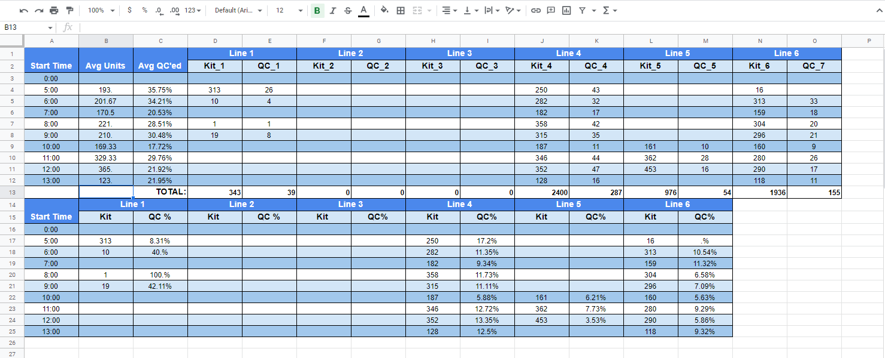
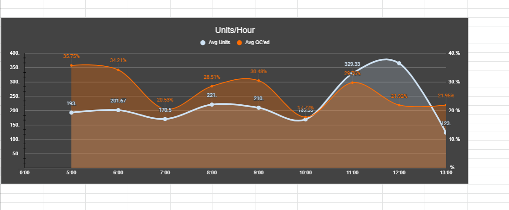
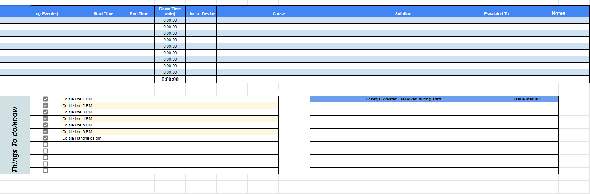

# Automating-Production-Report-with-Google-Sheets
Automating a daily production report with data analysis and on site support logs

# Results   

## Unit Count and Percentage Count
   

## Comparing Items Completed as Finish Good & Items QC'ed
   

## Onsite Support Problem Logs
 

